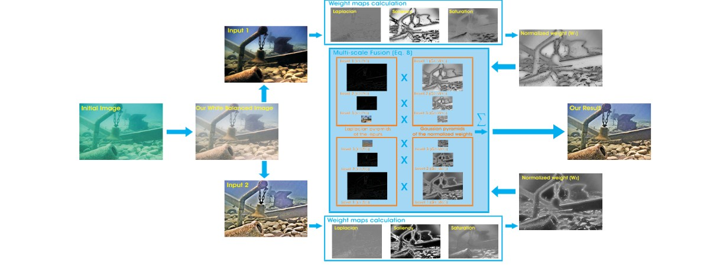

# Sai-paleti25-Dip--Color-Balance-and-Fusion-for-Underwater-Image-Enhancement

It’s a web Based Application Which provides a novel approach for removing haze, noise correction,
temperature correction in underwater images taken by any type of camera provides an interface for improving contrast, edge correction and image sharpening etc.

# Architecture of the Model

Library:
OpenCv, python

Note: 
1) To Get Better Understanding of the project please refer to the project paper provided above.
2) Implemented in both MATLAB and Python Both the implementations are provided above
